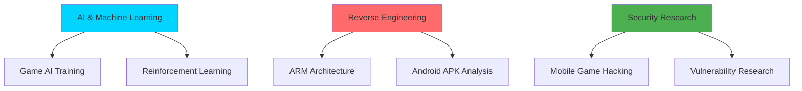

<div align="center">
  
</div>

<div align="center">
  
</div>

---

## 🚀 About Me

```python
class Alexander:
    def __init__(self):
        self.name = "Alexander"
        self.role = "Computer Science Student"
        self.interests = [
            "Artificial Intelligence",
            "Software Engineering", 
            "Reverse Engineering",
            "Game Hacking"
        ]
        self.current_focus = [
            "AI model training",
            "ARM architecture reverse engineering",
            "Game hacking research"
        ]
    
    def learn(self):
        return "Always exploring new technologies and pushing boundaries"
    
    def code(self):
        return "Building the future, one algorithm at a time"
```

---

## 🛠️ Technical Skills

### 💻 Programming Languages

<div align="center">
  
  
  
  
  
  
</div>

| Language | Proficiency | Progress |
|----------|-------------|----------|
| **Python** | Intermediate | ████████░░ 80% |
| **HTML/CSS** | Intermediate | ████████░░ 80% |
| **JavaScript** | Beginner | ████░░░░░░ 40% |
| **C#** | Beginner | ████░░░░░░ 40% |
| **C++** | Beginner | ████░░░░░░ 40% |

### 🤖 AI/ML Technologies

<div align="center">
  
  
  
</div>

- 🧠 **Machine Learning Fundamentals**
- 🎯 **Reinforcement Learning** (Currently Learning)
- 🚀 **AI Model Training & Usage**

### 🔍 Reverse Engineering & Security Tools

<div align="center">
  
  
  
  
  
  
</div>

| Tool | Experience Level | Status |
|------|------------------|--------|
| **Cheat Engine** | Proficient | ✅ |
| **DnSpy** | Proficient | ✅ |
| **.NET Reflector** | Proficient | ✅ |
| **IDA Pro** | Intermediate | 🔄 |
| **Ghidra** | Intermediate | 🔄 |
| **Frida** | Learning | 📚 |
| **APKTool** | Learning | 📚 |

---

## 🎯 Current Learning & Projects

### 🎮 AI Gaming Projects
- **Snake AI**: Training neural networks to master the classic Snake game
- **Pong AI**: Developing AI agents for competitive Pong gameplay
- **Game Hacking Research**: Exploring AI applications in game modification

### 🔬 Reverse Engineering Focus
- **ARM Architecture**: Deep diving into ARM assembly and architecture
- **Android APK Analysis**: Static analysis techniques for mobile applications
- **Mobile Game Security**: Researching security vulnerabilities in mobile games

---

## 🎨 Interests & Hobbies

<div align="center">
  
  
  
  
</div>

- 🔬 **Technology Exploration**: Always curious about emerging technologies
- 💰 **Finance & Market Analysis**: Understanding economic systems and trends
- 🧬 **Biology & Sciences**: Fascinated by natural systems and processes
- 🔒 **Security Research**: Passionate about software and hardware security

---

## 📊 GitHub Statistics

<div align="center">
  
  
</div>

<div align="center">
  
</div>

---

## 🏆 GitHub Trophies

<div align="center">
  
</div>

---

## 📈 Contribution Graph

<div align="center">
  
</div>

---

## 🎯 Current Focus Areas



---

## 📚 Learning Journey

<div align="center">
  
</div>

> *"The best way to learn is by doing, and the best way to do is by breaking things apart to understand how they work."*

---

## 🌐 Connect With Me

<div align="center">
  <a href="mailto:your.email@example.com">
    
  </a>
  <a href="https://linkedin.com/in/your-profile">
    
  </a>
  <a href="https://github.com/YOUR_USERNAME">
    
  </a>
  <a href="https://twitter.com/your-handle">
    
  </a>
</div>

---

## 🎮 Fun Fact

<div align="center">
  
</div>

---

<div align="center">
  
</div>

<div align="center">
  
</div>
